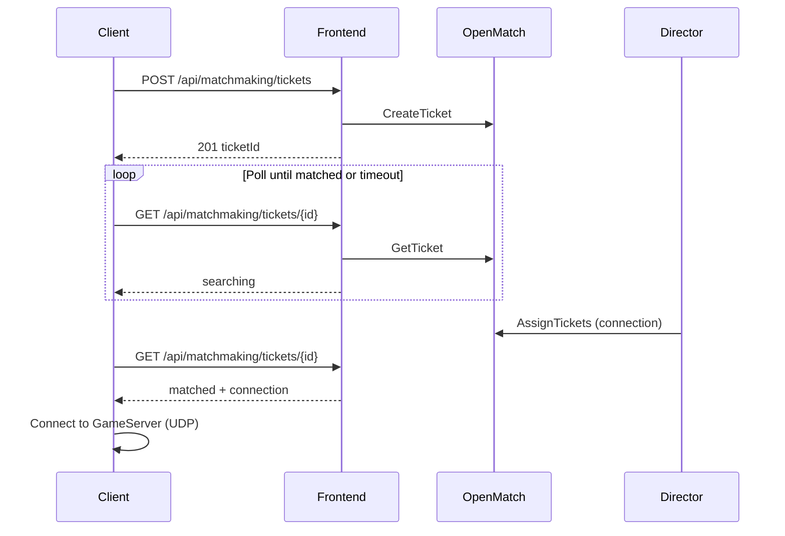

# Skulls Ludo Matchmaker
Skulls Ludo matchmaker and server allocator, built using Open Match and agones using C# .NET 10 LTS.

## Development Setup

### Requirenment
1. Minikube
2. Helm
3. Docker
4. .NET 10 LTS
5. OpenSSL

### Steps

1. Use minikube to create kubernetes cluster. If using docker drivers make sure to open UDP ports for the gameservers i.e. 
```powershell
minikube start -p skulls-mm --kubernetes-version v1.34.6 --ports=8080:8080/tcp --ports=7000-7100:7000-7100/udp
```

2. Install agones using helm.

3. Install open match using helm. 
NOTE: See openmatch pod status, if there is an issue pulling redis images make sure you change redis image when install open match using helm i.e.
```powershell
helm install --create-namespace open-match open-match/open-match \
  --namespace open-match \
  --set redis.image.repository=bitnami/redis \
  --set redis.image.tag=latest \
  --set redis.metrics.image.repository=bitnami/redis-exporter \
  --set redis.metrics.image.tag=latest
```
In this command you could change redis image, in case you want to pin a version.

4. You have to setup agones mTLS for the **director** to be able to allocate gameserver. Use [`scripts/setup-allocator-mtls.ps1`](scripts/setup-allocator-mtls.ps1), or manually look for secrets created by helm:
```powershell
kubectl get secret -A
```
Note: You should have the followings: **allocator-tls-ca**, **allocator-client.default**, and **allocator-client-ca** (**allocator-client.default** entry)
You have to dump these secrets into files
```powershell
kubectl get secret <secret> -n <namespace> -o json
```
and dump these into a file using
```powershell
$file = "<file_to_store_secret>"
$secret = "<copied_base64_secret>"
[System.IO.File]::WriteAllBytes($file, [convert]::FromBase64String($secret))
```
Or for linux (bash):
```powershell
# From the secret JSON, copy the base64 value of the field you need (e.g. tls.crt)
echo '<copied_base64_secret>' | base64 -d > <file_to_store_secret>
```

5. After sucessfully dumping the secrets into file, check to make sure these secrets are valid:
```powershell
openssl x509 -in <crt_file> -text -noout
```
and
```powershell
# allowed-ca.crt = dumped from allocator-client-ca
# client.crt = dumped from allocator-client.default
openssl verify -CAfile allowed-ca.crt client.crt
```
Note: If these checks fail, then you might have made a mistake dumping the files, and you have to try again.

6. Create secrets for the **director** (so it can see and able to allocate the server by agones):
```powershell
# client.crt + client.key = dumped from allocator-client.default
kubectl create secret tls allocator-client-tls \
    -n default \
    --cert=client.crt \
    --key=client.key

# server-ca.crt = dumped from allocator-tls-ca
kubectl create secret generic allocator-server-ca \
    -n default \
    --from-file=ca.crt=server-ca.crt
```

7. After all this, your cluster config + agones + open match is done. Now you must build the docker images ([`Dockerfile.frontend`](Dockerfile.frontend), [`Dockerfile.evaluator`](Dockerfile.evaluator), [`Dockerfile.director`](Dockerfile.director), [`Dockerfile.matchfunction`](Dockerfile.matchfunction)):
```powershell
docker build -f Dockerfile.frontend . -t skulls-ludo-matchmaker-frontend:latest
docker build -f Dockerfile.evaluator . -t skulls-ludo-matchmaker-evaluator:latest
docker build -f Dockerfile.director . -t skulls-ludo-matchmaker-director:latest
docker build -f Dockerfile.matchfunction . -t skulls-ludo-matchmaker-matchfunction:latest
```

8. Load these images into your minikube cluster:
```powershell
minikube image load -p skulls-mm skulls-ludo-matchmaker-frontend:latest --overwrite
minikube image load -p skulls-mm skulls-ludo-matchmaker-evaluator:latest --overwrite
minikube image load -p skulls-mm skulls-ludo-matchmaker-director:latest --overwrite
minikube image load -p skulls-mm skulls-ludo-matchmaker-matchfunction:latest --overwrite
```

9. Check if all the images are loaded properly:
```powershell
minikube image ls -p skulls-mm
```
Note: If you don't see your images, you have done something wrong in either image creation or loading, and you have to try again.

10. Apply the yaml files from [`k8s/`](k8s/) into your cluster:
```powershell
kubectl apply -f ./k8s/frontend-deployment.yaml
kubectl apply -f ./k8s/evaluator-deployment.yaml
kubectl apply -f ./k8s/open-match-override-configmap.yaml
kubectl apply -f ./k8s/director-deployment.yaml
kubectl apply -f ./k8s/director-pdb.yaml
kubectl apply -f ./k8s/matchfunction-deployment.yaml
kubectl apply -f ./k8s/fleet.yaml
kubectl apply -f ./k8s/queues-configmap.yaml
```

11. You'll see all your pods + services + open match + agones come alive. Then you could test using [`scripts/frontend/`](scripts/frontend/) — [`create-ticket.ps1`](scripts/frontend/create-ticket.ps1), [`get-ticket.ps1`](scripts/frontend/get-ticket.ps1), [`cancel-ticket.ps1`](scripts/frontend/cancel-ticket.ps1), and [`poll-ticket.ps1`](scripts/frontend/poll-ticket.ps1). Just make sure before doing this your frontend service is accessible through the host; use [`port-forward.ps1`](scripts/frontend/port-forward.ps1) for that.

## Frontend Interface

The **Skulls Ludo Frontend** (`SkullsLudo.Frontend`) is the player-facing HTTP API. It wraps Open Match’s gRPC Frontend service and exposes a small REST surface for creating tickets, polling match status, and canceling searches. Game clients should call this service—not Open Match directly.

### Access

| Environment | Base URL |
|-------------|----------|
| Kubernetes (in-cluster) | `http://skulls-ludo-frontend.default.svc.cluster.local` (Service port 80 → container 8080) |
| Local via port-forward | `http://localhost:19503` (default; see [`scripts/frontend/port-forward.ps1`](scripts/frontend/port-forward.ps1)) |
| Local `dotnet run` | See `applicationUrl` in `src/SkullsLudo.Frontend/Properties/launchSettings.json` |

Set `SKULLS_FRONTEND_URL` or pass `-BaseUrl` to the scripts under [`scripts/frontend`](scripts/frontend) to override the default.

### Authentication

All matchmaking routes require authentication.

| Mode | Config | How to authenticate |
|------|--------|---------------------|
| **Production** | `Matchmaker:UnityAuth:Enabled=true` | `Authorization: Bearer <Unity idToken>` — player id from JWT `sub` |
| **Dev / test** | `Matchmaker:UnityAuth:Enabled=false` | `X-Debug-Player-Id: <playerId>` header (simulate multiple players); if omitted, uses `DefaultDebugPlayerId` (`dev-player`) |

Unity JWKS: `https://player-auth.services.api.unity.com/.well-known/jwks.json` (cached in-memory, refreshed lazily after 8h or unknown `kid`).

Test scripts: set `$env:SKULLS_UNITY_ID_TOKEN` for Bearer auth, or pass `-PlayerId` / `$env:SKULLS_DEBUG_PLAYER_ID` for dev bypass.

**One ticket per player:** `POST` returns `409` if the player already has an active ticket. Cancel it with `DELETE` before creating another.

### Matchmaking API

All routes are under `/api/matchmaking/tickets`.

#### `POST /api/matchmaking/tickets`

Enqueue a player for matchmaking.

**Request body** (`application/json`):

| Field | Type | Required | Constraints |
|-------|------|----------|-------------|
| `mmr` | number | yes | 0–100000 |
| `queue` | string | yes | Must match a key in `Matchmaker:Queues` (see [Queues](#queues) below) |

**Responses:**

| Status | Body |
|--------|------|
| `201 Created` | `{ "ticketId": "<uuid>" }` — `Location` header points to the ticket URL |
| `400` | Validation problem (unknown queue, invalid fields) |
| `401` | Missing or invalid Unity idToken (when auth enabled) |
| `409` | Player already has an active ticket |
| `429` | Rate limit exceeded (see [Rate limiting](#rate-limiting)) |

**Example (dev bypass):**

```powershell
$body = @{ mmr = 1500; queue = "quickplay-nonteam" } | ConvertTo-Json
Invoke-RestMethod -Method POST -Uri "$env:SKULLS_FRONTEND_URL/api/matchmaking/tickets" `
    -ContentType "application/json" -Body $body -Headers @{ "X-Debug-Player-Id" = "alice" }
```

```bash
export SKULLS_FRONTEND_URL=http://localhost:19503
curl -sS -X POST "${SKULLS_FRONTEND_URL}/api/matchmaking/tickets" \
  -H "Content-Type: application/json" \
  -H "X-Debug-Player-Id: alice" \
  -d '{"mmr":1500,"queue":"quickplay-nonteam"}'
```

**Example (Unity idToken):**

```bash
curl -sS -X POST "${SKULLS_FRONTEND_URL}/api/matchmaking/tickets" \
  -H "Content-Type: application/json" \
  -H "Authorization: Bearer ${SKULLS_UNITY_ID_TOKEN}" \
  -d '{"mmr":1500,"queue":"quickplay-nonteam"}'
```

Or: `.\scripts\frontend\create-ticket.ps1 -PlayerId alice -Mmr 1500 -Queue quickplay-nonteam`

#### `GET /api/matchmaking/tickets/{ticketId}`

Poll matchmaking status. Clients should call this on an interval (e.g. every 2–5 seconds) until the status is terminal.

**Responses:**

| Status | Body |
|--------|------|
| `200 OK` | See [Ticket status](#ticket-status) |
| `404` | Ticket not found, not owned by caller, deleted, or expired |

When status becomes `timeout`, the Frontend deletes the Open Match ticket automatically; further polls return `404`.

**Example:**

```powershell
Invoke-RestMethod -Method GET -Uri "$env:SKULLS_FRONTEND_URL/api/matchmaking/tickets/<ticketId>" `
    -Headers @{ "X-Debug-Player-Id" = "alice" }
```

```bash
curl -sS "${SKULLS_FRONTEND_URL}/api/matchmaking/tickets/<ticketId>" \
  -H "X-Debug-Player-Id: alice"
```

Tickets belong to the authenticated player; other players receive `404`.

Or: `.\scripts\frontend\get-ticket.ps1 -TicketId <ticketId> -PlayerId alice` — `.\scripts\frontend\poll-ticket.ps1` loops until `matched` or `timeout`.

#### `DELETE /api/matchmaking/tickets/{ticketId}`

Cancel an in-progress search.

**Responses:**

| Status | Meaning |
|--------|---------|
| `204 No Content` | Ticket canceled |
| `404` | Ticket not found |
| `409` | Ticket already matched (cancel not allowed) |

**Example:**

```powershell
Invoke-WebRequest -Method DELETE -Uri "$env:SKULLS_FRONTEND_URL/api/matchmaking/tickets/<ticketId>" `
    -Headers @{ "X-Debug-Player-Id" = "alice" }
```

```bash
curl -sS -o /dev/null -w "%{http_code}\n" -X DELETE \
  -H "X-Debug-Player-Id: alice" \
  "${SKULLS_FRONTEND_URL}/api/matchmaking/tickets/<ticketId>"
```

Or: `.\scripts\frontend\cancel-ticket.ps1 -TicketId <ticketId> -PlayerId alice`

### Ticket status

The `status` field in `GET` responses is one of:

| Status | Meaning | Client action |
|--------|---------|----------------|
| `searching` | Still in queue | Keep polling |
| `matched` | Assignment ready | Connect using `connection`; optional `playerCount` |
| `timeout` | No match within search window | Return player to menu / retry |

**Matched response shape:**

```json
{
  "ticketId": "…",
  "status": "matched",
  "connection": "10.0.0.12:7123",
  "playerCount": 4
}
```

`connection` is `host:port` for the allocated Agones GameServer (UDP game traffic). `playerCount` is set by the Director when the match is formed.

### Queues

Valid `queue` values come from `k8s/queues-configmap.yaml` (mounted at `/config/queues.json`) or the built-in defaults in `DefaultQueues.cs`:

| Queue | Strategy | Players | Notes |
|-------|----------|---------|-------|
| `practice-team` | solo | 1–4 | 30s timeout |
| `practice-nonteam` | solo | 1–4 | 30s timeout |
| `quickplay-team` | degrading-mmr | 2–4 | MMR widens after 15s |
| `quickplay-nonteam` | degrading-mmr | 2–4 | Degrades to 3p @ 5s, 2p @ 15s |
| `classic-team` | degrading-mmr | 2–4 | 2 min timeout |
| `classic-nonteam` | degrading-mmr | 2–4 | 2 min timeout |
| `ranked` | degrading-mmr | 4 only | 5 min timeout, no degradation |
| `casual` | degrading-mmr | 2–4 | 2 min timeout |

Unknown queue names return `400` with a list of valid keys.

### Rate limiting

`POST /api/matchmaking/tickets` is limited per client IP (fixed window). Defaults in `k8s/frontend-deployment.yaml`:

- **1** request per **10** seconds per IP (`429 Too Many Requests`)

The Service uses `externalTrafficPolicy: Local` so the limiter sees real client IPs behind the LoadBalancer.

### Health and OpenAPI

| Endpoint | Purpose |
|----------|---------|
| `GET /healthz/live` | Liveness (process up) |
| `GET /healthz/ready` | Readiness (can reach Open Match Frontend) |
| `GET /openapi/v1.json` | OpenAPI document (ASP.NET built-in) |

`.\scripts\frontend\health-check.ps1` probes readiness; use `/healthz/ready` (not `/healthz`).

### Typical client flow



On timeout or explicit cancel, call `DELETE` or stop polling after receiving `timeout` (the ticket is removed server-side).

### Configuration

Frontend-specific settings under `Matchmaker:Frontend` in `appsettings.json` / deployment env vars:

| Setting | Default | Description |
|---------|---------|-------------|
| `TicketSearchTimeoutSeconds` | `120` | Max age while `searching` before API reports `timeout` |
| `CreateTicketRateLimitPermits` | `1` | POST allowance per window per IP |
| `CreateTicketRateLimitWindowSeconds` | `10` | Rate limit window length |

Open Match gRPC target: `Matchmaker:OpenMatch:FrontendHost` / `FrontendPort` (default `open-match-frontend…:50504`).

## Queue configuration and updates

Matchmaking queues are **configuration data**, not code. The canonical source in Kubernetes is [`k8s/queues-configmap.yaml`](k8s/queues-configmap.yaml), which creates ConfigMap `skulls-ludo-queues` with key `queues.json`.

Three services mount that file at `/config/queues.json` and load it at startup:

| Deployment | Why it reads queues |
|------------|---------------------|
| `skulls-ludo-frontend` | Validates `queue` on `POST /tickets` |
| `skulls-ludo-director` | Builds Open Match pools/profiles per queue |
| `skulls-ludo-matchfunction` | Resolves `strategy` → match logic |

If the ConfigMap is missing, all three fall back to [`DefaultQueues.cs`](src/SkullsLudo.Shared/Configuration/DefaultQueues.cs). Keep that file in sync when you change defaults for local `dotnet run`.

### Queue entry schema

Each key under `Matchmaker.Queues` is the queue id clients send in API requests (e.g. `quickplay-nonteam`). The value fields:

| Field | Type | Description |
|-------|------|-------------|
| `Name` | string | Display name; should match the dictionary key |
| `Tag` | string | Open Match search tag (e.g. `queue.quickplay-nonteam`). The Frontend stamps this on new tickets |
| `Strategy` | string | `solo` or `degrading-mmr` (see `WellKnown.Strategies`) |
| `MaxPlayers` | int | Upper bound for a match in this queue |
| `MinPlayers` | int | Minimum players before a match can form |
| `Timeout` | string | Max search duration (`hh:mm:ss`, e.g. `00:01:00`) |
| `DegradationSteps` | array | Optional; each step has `After` (`hh:mm:ss`) and `PlayerCount` (relax min players after waiting) |

Example — add a experimental queue:

```json
"experimental": {
  "Name": "experimental",
  "Tag": "queue.experimental",
  "Strategy": "degrading-mmr",
  "MaxPlayers": 4,
  "MinPlayers": 2,
  "Timeout": "00:01:30",
  "DegradationSteps": [
    { "After": "00:00:20", "PlayerCount": 2 }
  ]
}
```

`Tag` must be unique per queue. `Strategy` must be implemented in the MatchFunction (`solo`, `degrading-mmr` today).

### Apply changes

Configuration is read **once at pod start** (`reloadOnChange: false`). Editing the live ConfigMap does not update running pods; roll them after you apply.

1. Edit `k8s/queues-configmap.yaml` (or patch in place):

```powershell
kubectl apply -f .\k8s\queues-configmap.yaml
```

```powershell
kubectl apply -f ./k8s/queues-configmap.yaml
```

2. Restart the consumers so they remount the updated file:

```powershell
kubectl rollout restart deployment/skulls-ludo-frontend deployment/skulls-ludo-director deployment/skulls-ludo-matchfunction
kubectl rollout status deployment/skulls-ludo-frontend
kubectl rollout status deployment/skulls-ludo-director
kubectl rollout status deployment/skulls-ludo-matchfunction
```

3. Verify the mount (optional):

```powershell
kubectl exec deploy/skulls-ludo-frontend -- cat /config/queues.json
```

4. Smoke-test: create a ticket with the new queue name via [`scripts/frontend/create-ticket.ps1`](scripts/frontend/create-ticket.ps1). An unknown queue returns `400` with the list of valid keys.

### Notes

- **No image rebuild** is required for queue-only changes — only the ConfigMap and rollout above.
- **Renaming or removing** a queue does not cancel tickets already in Open Match with the old tag; drain or wait for timeouts before deleting a queue clients still use.
- For local development without Kubernetes, add a `Matchmaker:Queues` section to `appsettings.json` or place `queues.json` at `/config/queues.json` in your dev environment.
